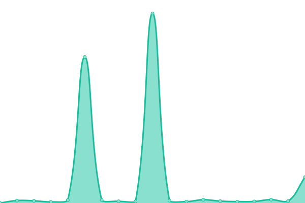

# [📈 Live Status](https://status.coregistros.com): <!--live status--> **🟩 All systems operational**

Raiola (WordPress)

<!--start: status pages-->
<!-- This summary is generated by Upptime (https://github.com/upptime/upptime) -->
<!-- Do not edit this manually, your changes will be overwritten -->
<!-- prettier-ignore -->
| URL | Status | History | Response Time | Uptime |
| --- | ------ | ------- | ------------- | ------ |
|  [coregistros.com](https://www.coregistros.com) | 🟩 Up | [coregistros-com.yml](https://github.com/arosa-cor/coregistros/commits/HEAD/history/coregistros-com.yml) | 

 684ms
     
 | 

<a href="https://arosa-cor.github.io/coregistros/history/coregistros-com">100.00%</a>
    

|  [blog.sorteopremios.com](https://blog.sorteopremios.com/robots.txt) | 🟩 Up | [blog-sorteopremios-com.yml](https://github.com/arosa-cor/coregistros/commits/HEAD/history/blog-sorteopremios-com.yml) | 

 1214ms
     
 | 

<a href="https://arosa-cor.github.io/coregistros/history/blog-sorteopremios-com">20.60%</a>
    

|  [mitest.de](https://mitest.de) | 🟩 Up | [mitest-de.yml](https://github.com/arosa-cor/coregistros/commits/HEAD/history/mitest-de.yml) | 

 259ms
     
 | 

<a href="https://arosa-cor.github.io/coregistros/history/mitest-de">100.00%</a>
    

|  [bevrand.com](https://www.bevrand.com) | 🟩 Up | [bevrand-com.yml](https://github.com/arosa-cor/coregistros/commits/HEAD/history/bevrand-com.yml) | 

 3120ms
     
 | 

<a href="https://arosa-cor.github.io/coregistros/history/bevrand-com">39.55%</a>
    

|  [milopciones.es](https://milopciones.es) | 🟩 Up | [milopciones-es.yml](https://github.com/arosa-cor/coregistros/commits/HEAD/history/milopciones-es.yml) | 

 1271ms
     
 | 

<a href="https://arosa-cor.github.io/coregistros/history/milopciones-es">100.00%</a>
    

|  [g0crm.info (API WP)](https://g0crm.info/wp-json/) | 🟩 Up | [g0crm-info-api-wp.yml](https://github.com/arosa-cor/coregistros/commits/HEAD/history/g0crm-info-api-wp.yml) | 

 572ms
     
 | 

<a href="https://arosa-cor.github.io/coregistros/history/g0crm-info-api-wp">100.00%</a>
    

<!--end: status pages-->

## 📄 License

- Powered by: [Upptime](https://github.com/upptime/upptime)
