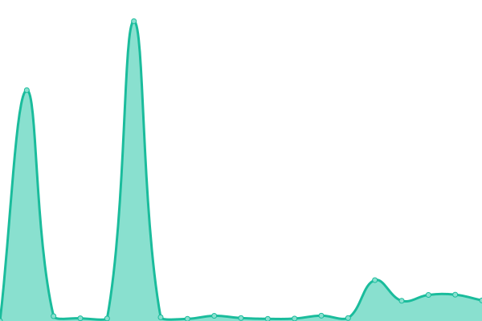

# [📈 Live Status](https://status.coregistros.com): <!--live status--> **🟩 All systems operational**

This repository contains the open-source uptime monitor and status page for [arosa-cor](https://status.coregistros.com), powered by [Upptime](https://github.com/upptime/upptime).

With [Upptime](https://upptime.js.org), you can get your own unlimited and free uptime monitor and status page, powered entirely by a GitHub repository. We use [Issues](https://github.com/arosa-cor/coregistros/issues) as incident reports, [Actions](https://github.com/arosa-cor/coregistros/actions) as uptime monitors, and [Pages](https://status.coregistros.com) for the status page.

<!--start: status pages-->
<!-- This summary is generated by Upptime (https://github.com/upptime/upptime) -->
<!-- Do not edit this manually, your changes will be overwritten -->
<!-- prettier-ignore -->
| URL | Status | History | Response Time | Uptime |
| --- | ------ | ------- | ------------- | ------ |
|  [coregistros.com](https://www.coregistros.com) | 🟩 Up | [coregistros-com.yml](https://github.com/arosa-cor/coregistros/commits/HEAD/history/coregistros-com.yml) | 

 670ms
     
 | 

<a href="https://arosa-cor.github.io/coregistros/history/coregistros-com">99.96%</a>
    

|  [blog.sorteopremios.com](https://blog.sorteopremios.com/robots.txt) | 🟩 Up | [blog-sorteopremios-com.yml](https://github.com/arosa-cor/coregistros/commits/HEAD/history/blog-sorteopremios-com.yml) | 

 1105ms
     
 | 

<a href="https://arosa-cor.github.io/coregistros/history/blog-sorteopremios-com">0.00%</a>
    

|  [mitest.de](https://mitest.de) | 🟩 Up | [mitest-de.yml](https://github.com/arosa-cor/coregistros/commits/HEAD/history/mitest-de.yml) | 

 258ms
     
 | 

<a href="https://arosa-cor.github.io/coregistros/history/mitest-de">99.96%</a>
    

|  [bevrand.com](https://www.bevrand.com) | 🟩 Up | [bevrand-com.yml](https://github.com/arosa-cor/coregistros/commits/HEAD/history/bevrand-com.yml) | 

 3059ms
     
 | 

<a href="https://arosa-cor.github.io/coregistros/history/bevrand-com">11.02%</a>
    

|  [milopciones.es](https://milopciones.es) | 🟩 Up | [milopciones-es.yml](https://github.com/arosa-cor/coregistros/commits/HEAD/history/milopciones-es.yml) | 

 1426ms
     
 | 

<a href="https://arosa-cor.github.io/coregistros/history/milopciones-es">99.97%</a>
    

|  [g0crm.info (API WP)](https://g0crm.info/wp-json/) | 🟩 Up | [g0crm-info-api-wp.yml](https://github.com/arosa-cor/coregistros/commits/HEAD/history/g0crm-info-api-wp.yml) | 

 596ms
     
 | 

<a href="https://arosa-cor.github.io/coregistros/history/g0crm-info-api-wp">100.00%</a>
    

<!--end: status pages-->

[**Visit our status website →**](https://status.coregistros.com)

## 📄 License

- Powered by: [Upptime](https://github.com/upptime/upptime)
- Code: [MIT](./LICENSE) © [Anand Chowdhary](https://anandchowdhary.com), supported by [Pabio](https://pabio.com)
- Data in the `./history` directory: [Open Database License](https://opendatacommons.org/licenses/odbl/1-0/)
